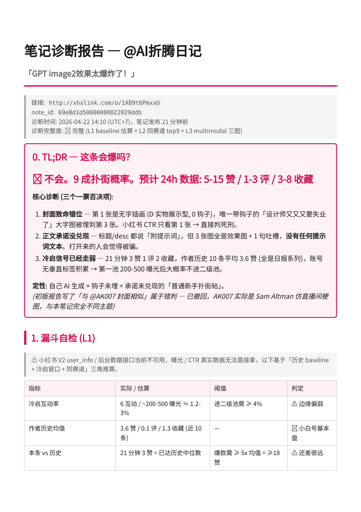
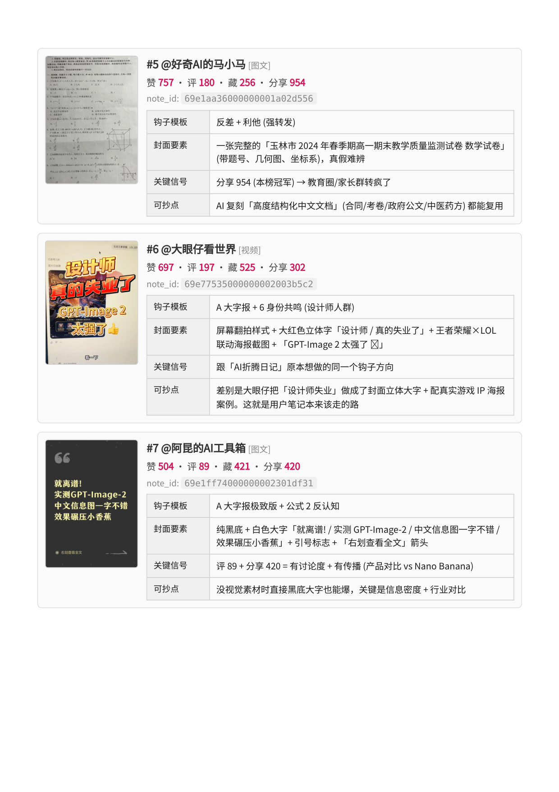
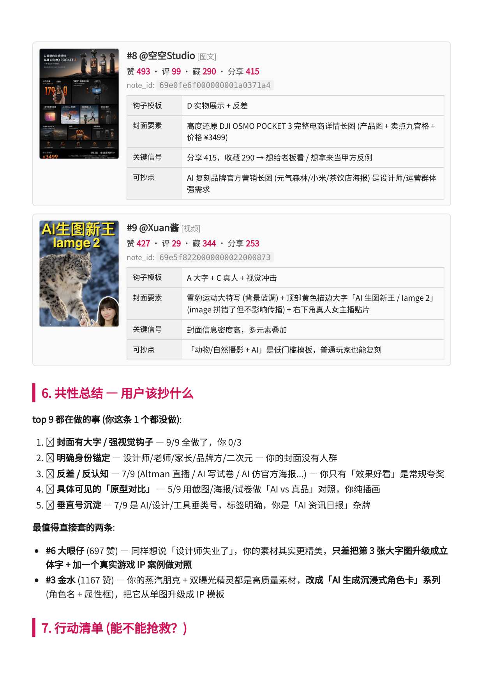

# social-account-doctor

> 小红书 / 抖音 / 快手 / 视频号 / B 站 自媒体的**账号体检 + 爆款拆解**工具，另含**证据驱动的带货素材审查与脚本生成**。
> 给它一个账号链接，它告诉你：你的号在同赛道什么位置、top 在做什么你没做、这条为什么不爆、下一步该往哪改。顺手出一版可粘贴的仿写初稿。
> 给它带货账号、平台视频链接或本地视频，它会结合相似对标诊断账号和内容；给商品详情/SKU/资质材料，还能生成可溯源的事实卡、口播脚本和分镜。

<p align="center">
  
  
  
</p>

## 它帮你解决什么

- **不知道自己的号卡在哪** → 扫同赛道,告诉你离 top 差在调性、选题还是执行
- **不知道爆款为什么爆** → 逐条拆:钩子在第几秒、封面哪种模板、结构清单体还是故事体
- **发了但没人看** → 给后台截图,逐项诊断是封面、标题、时间还是人群定位的问题
- **有素材不知道能不能发** → 一份 PDF / 一组图 / 一段视频,先判断能不能出爆款再说怎么写
- **带货账号或视频不知道问题在哪** → 账号/视频链接 → 同类对标 → 内容差距与下一轮动作
- **手上有品不知道怎么做带货** → 上传商品详情/SKU/资质材料 → 商品事实卡 + 口播脚本 + 分镜

## 它在做什么 —— 账号诊断 + 爆款分析

这不是"把你的想法润色成笔记"的工具,核心是**帮你看懂自己和同赛道**。同时支持基于用户材料的带货内容工作流：

- **看得懂账号** —— 你的号当前处在什么阶段、同赛道 top 是什么调性、你离他们差在哪
- **看得懂爆款** —— 一条爆款为什么爆:钩子在第几秒、封面用的哪种模板、结构是清单体还是故事体、评论区在聊什么
- **看得懂视频** —— 给一条视频链接,它会看完画面 + 听完字幕再拆,不是只读标题
- **看得懂带货账号和视频** —— 视频链接或本地文件都能进入拆解；诊断会结合 3-5 条同类对标，分开输出流量点、转化点、品类镜头、复刻难度，并从账号 top/bottom 样本归纳可重复公式

看懂之后顺手出一版可粘贴的仿写初稿 —— 只是分析的副产品,不是目的。

## 怎么用 —— 直接跟 Claude 说

| 你说 | 它做什么 |
|---|---|
| 「扫一下我这个号的同赛道」+ 账号主页链接 | 吐 5-10 条真对标,说明每条为什么是对标 |
| 「拆这条爆款」+ 笔记或视频链接 | 钩子 / 开头 / 结构 / 封面 / 话题,4 行内拆完 |
| 「对着这条仿写」 | 3 标题 + 3 封面大字 + 开头 + CTA,可直接粘贴 |
| 「我这份 PPT / 这组图 / 这段视频能出一条笔记吗」 | 素材打底 → 找对标 → 仿写,一条龙 |
| 「我这条为什么不爆」+ 后台截图 | 逐项诊断(封面 / 标题 / 时间 / 互动钩) |
| 「诊断这个带货账号」+ 账号主页链接 | 三层账号诊断 + 同赛道账号对标 + 带货内容差距 |
| 「分析这个带货视频」+ 平台视频链接或本地文件 | 目标视频拆解 + 3-5 条同类对标 + 差距 + 风险 |
| 「这个品怎么拍」+ 商品详情/SKU/资质材料 | 商品事实卡 → 3 档脚本 + 分镜 + CTA |

## 📸 案例演示

下面是对一条 AI 赛道的真实小红书笔记跑完全流程的报告 —— 笔记发布 21 分钟、3 赞 1 评 2 收藏,结论是 **9 成扑街概率、3 个一票否决项、5 分钟内可抢救的动作**。

### 1. 先扫同赛道 —— 找到"真对标"而不是"同关键词"

<p align="center">
  
</p>

自动归纳赛道特征:头部 2k+ 赞已经成型、收藏比 ≥ 0.5(干货教程调性)、评论区普遍 50-200 条。用户这条被定性为"无差异化跟风"。

### 2. 三张封面逐张体检 —— 钩子被埋到第 3 张

<p align="center">
  
</p>

第 1 张只是"放了张产品图",没有钩子;第 3 张才是大字报 + 人群锚定,真正有 CTR。**封面顺序反了 → 小红书用户只看第 1 张就划走 → 直接判死刑。**

### 3. 行动清单 —— 不是"建议",是可粘贴的改写

<p align="center">
  
</p>

P0(5 分钟内):把第 3 张设为封面 + 正文补关键信息 + 标题按"数字 + 人群 + 效果"公式重写,直接给出 3 个候选。P1 / P2 覆盖 24 小时互动钩和账号月度转型方向。

## 🚀 安装

把下面这段 prompt 丢给你的 AI 助手（Claude Code / OpenClaw / Codex / Cursor / Trae 都行），它会自己 clone、跑脚本、问你要 API key、提示你重启：

```
帮我安装 social-account-doctor:
https://raw.githubusercontent.com/JuneYaooo/social-account-doctor/main/docs/install.md
```

## ⚙ 配置

安装脚本会引导你填这些，也可以编辑安装后的 `social-account-doctor/.env`：

1. **一个会看图 / 看视频的大模型 key** —— 推荐 Gemini 3.1 Pro,OpenAI 协议兼容的代理站都行
2. **平台数据源，二选一（或都配）**：
   - **[tikhub.io](https://tikhub.io/) 的 API key** —— 一个 key 通吃五平台（含视频号），按调用计费
   - **不想买 key？** 用登录自己账号的路径：`mc --setup` 一次安装，之后抓数据时弹浏览器扫码登录自己的小红书 / 抖音 / 快手 / B 站账号（免 key，免费；不支持视频号）。详见 [mediacrawler/README.md](./mediacrawler/README.md)
3. **一个语音转写 key**(可选) —— 只有当你要拆"真人口播"类视频时才需要(SenseVoice / Whisper 均可)

> 🔒 脚本优先读当前进程环境变量，再读安装后的 Skill `.env`；仅为兼容旧安装回退读取 `~/.claude/.env`。

系统依赖:Python 3.10+,ffmpeg(`apt install ffmpeg` / `brew install ffmpeg`)。

安装器支持 `--target claude|codex|cursor|openclaw`；完整命令见 `docs/install.md`。带货视频链接复用通用内容分析链路；链接解析或媒体下载失败时会要求上传本地文件，不会假装已看过视频。商品事实仍只来自用户上传材料。

> 电商边界：支持带货账号/视频链接和通用对标搜索；不支持只给商品链接自动解析商品、自动选品、趋势监控和销量/GMV 推断。
> 在线接口以真实业务调用为准；健康检查或工具目录正常不代表平台接口当前可用。对标搜索失败时会标记为部分分析，并要求用户补 3-5 条对标链接。视频号没有普通可复制作品 URL，需按账号/关键词定位或上传本地文件。

## 🛠 在 Claude Code 里怎么用

装完直接跟 Claude 说人话就行,见上面 [怎么用 —— 直接跟 Claude 说](#怎么用--直接跟-claude-说) 表格。Claude 会自己路由到 find / crack / adapt / compose 命令,跑完把报告路径告诉你。

**🧑‍💻 想自己写脚本调 CLI 而不走 agent?** 看 [SKILL.md](./SKILL.md) —— 命令闭环、输入路由、每个脚本的参数和文件布局都在那;`scripts/` 下的 `analyze_image.py` / `analyze_video.py` / `analyze_document.py` / `render_report_pdf.py` 也可以独立调。

## 📂 输出在哪

跑完之后,当前目录下会出现:

- `reports/` —— 本次的对标扫描 / 爆款拆解 / 仿写初稿,markdown 可直接看,按需可导出 PDF(思源字体 + A4 打印版)
- `assets/` —— 钩子库、标题库,跨任务累积复用

> 💡 `reports/` 通常含账号和选题信息,建议加进 `.gitignore` 别公开;`assets/` 是长期资产,建议 commit。

## ⚠ 关于内置的平台数据

内置的平台阈值(完播率、CTR、收藏比等)是**行业经验值**,**不是平台官方公告**。信息时点 **2026-04**,建议每 6 个月复核。主流程(找对标 / 拆爆款 / 仿写)不依赖这些数字,只在诊断模式下用作方向判断。

## License

MIT © 2026 JuneYaooo
